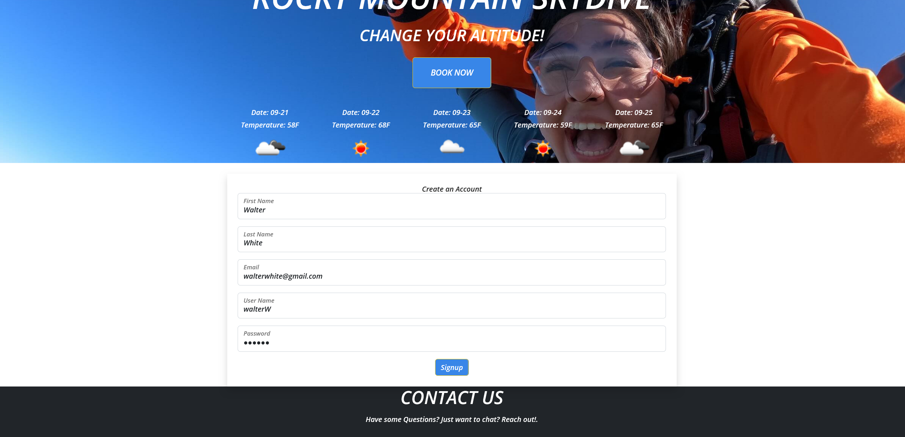
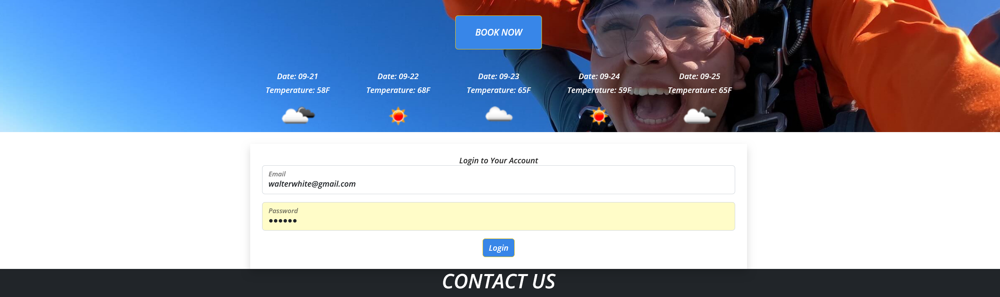
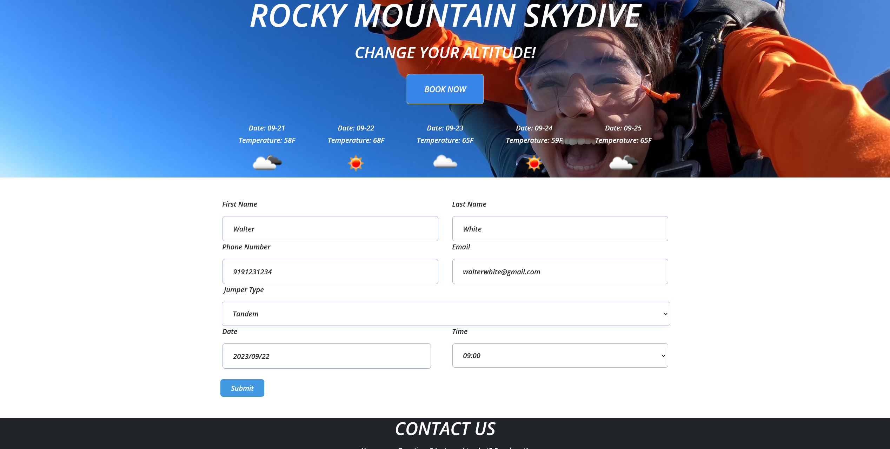
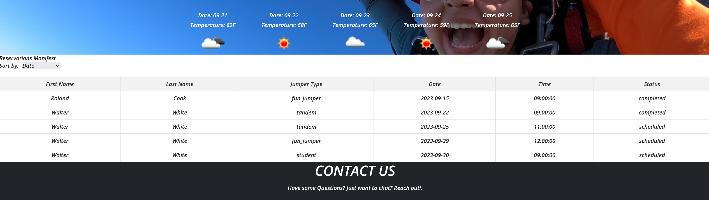
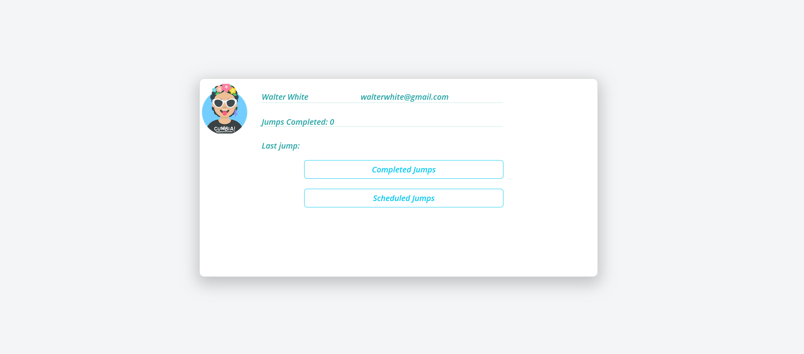
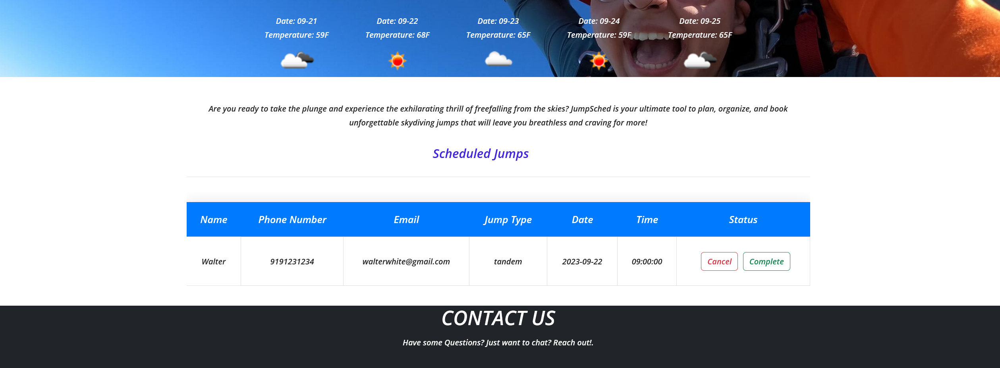
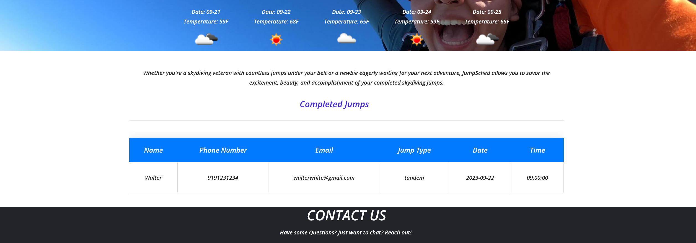
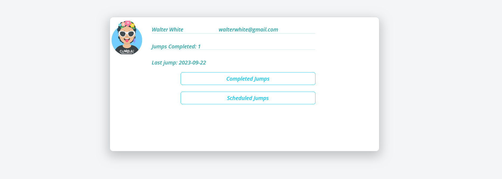
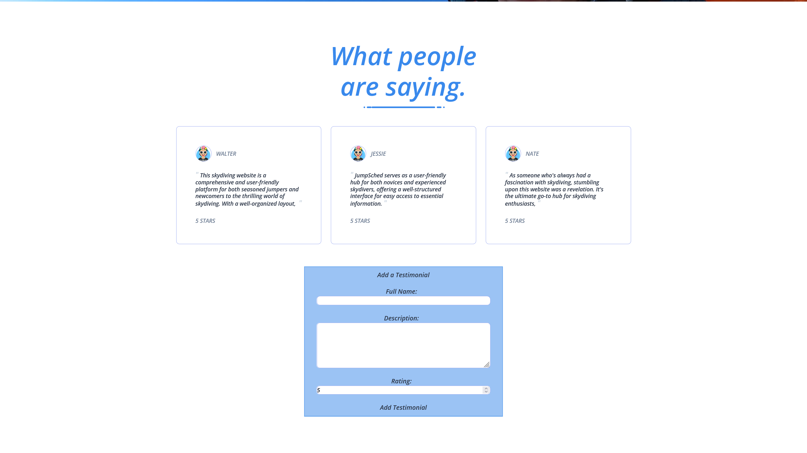

## Project Documentation

# JumpSched

- Nate Gallegos
- Derrick Mitchel
- Roland Cook
- Pedro De Jesus

We created a full stack app that allows users to sign-up for skyidives. We created some other pages for the site that display pricing, common questions, and a gallery on a carousel.
The team also created components that allow users to create an account, view the manifest for a given day. We also thought it a good idea to create a profile for the user that allows them to cancel their jumps, or finish their jumps depending. The completed jumps will display a list of only "completed" jumps.
We've also implemented the open weather api to display a 5 day forecast to better help customers schedule jumps. 

## Design

- [API design](docs/api-design.md)

## Intended market

We are targeting business owners that run their own drop zones, we provide a better solution that enables the business to give their customers an all inclusive skydiving experience. This application allows for companies to better schedule jumps while also being able to uniquely identify customers and their needs.

## Functionality

- Visitors of the site can learn more information about the company, and skydiving as a whole:
  - FAQ page that answers any questions customers may have about skydiving or about the business itself.
  - The prices page to allows customers to see the price of every service offered.
- Users can also see testimonials left by other users. Logged in users can see testimonials and the form allowing them to create their own.
- Reservation page that allows any user to book a jump. The logged in users who book can see those jumps on their profile page and also mark the jump as completed or cancelled.
- Manifest page lets logged in users see every jump and its status, this allows for the user and the business to better schedule jumps.
- Accounts
- Logged in users can add new testimonials, view/update their scheduled jumps.
- About Section with company info, contact info.
- Social Media Links/Contact at the footer
- Main Page allows visitors to see the 5 day weather forecast. Main page also includes more information about the business including a contact us and a company video. Also includes links to other services.

## Project Initialization

To fully enjoy this application on your local machine, please make sure to follow these steps:

1. Clone the repository down to your local machine
2. CD into the new project directory
    -Will require an openWeather api key in a .env file OPEN_WEATHER_API_KEY="insert your api key"
3. Run `docker volume create module3-project-gamma_postgres_data`
4. Run `docker compose build`
5. Run `docker compose up`
6. Run `docker exec -it module3-project-gamma-fastapi-1 bash`
7. Run  `python -m migrations up`
8. Exit the container's CLI, and enjoy JumpSched!

<h1> After the initialization is completed, users will have access to all the features outlined in the functionality section </h1>

### Users can fill out a form to signup for an account. 

### After users signup they are redirected to the login page. After the user is logged in they will have access to more features.

### The navbar is updated to include the manifest, profile and the logout button. 

### Users can book jumps by navigating to the reservations page

### Filling out this form lets users book a jump. This jump shows up on the manifest page and it also shows up in their profile's scheduled jumps page. The manifest can be sorted by date and jump type to help with scheduling.

### The profiles page has the users account details, how many jumps were marked as completed and the date of the last jump they've completed. To mark these jumps as completed or to cancel a jump users can go to their profile.

### Click on scheduled jumps, this will show all the jumps that were booked along with the status that can be changed to completed or cancelled. Choosing either of these options will remove that jump from this page. Cancel will delete the jump and completed will move it to completed jumps.

### These changes will immediately be reflected on the profile page.

### Users can also see all the testimonials that were created, logged in users have the extra capability to add their own testimonial.

## Technologies 
HTML, CSS, JavaSript, Python, React, FastApi, SASS, Bootstrap, Tailwind, PostgreSQL

## Project status
Still being worked on, The features that we wanted to add are done. The only thing left is to make this application mobile responsive via media quieries. 

